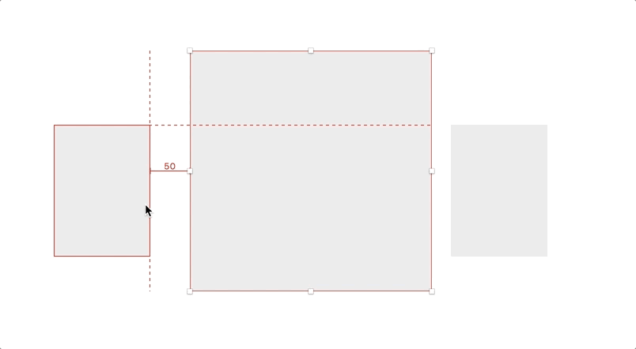
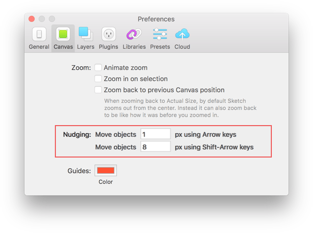

# Nudge RTL | Sketch Plugin

This plugin, _Nudge RTL_, is used quickly resize the width a layer through easy keyboard shortcuts. It's similar to using <kbd>⌘ cmd </kbd> + <kbd>→</kbd> or <kbd>⌘ cmd </kbd> + <kbd>←</kbd> but pinned from the right side of an object.

## Usage

<kbd>^ Ctrl</kbd> + <kbd>⌘ Cmd</kbd> + <kbd>←</kbd> = Expand layer size horizontally

<kbd>^ Ctrl</kbd> + <kbd>⌘ Cmd</kbd> + <kbd>→</kbd> = Shrink layer size horizontally

**Note: Add <kbd>⇧ Shift</kbd> to increase the nudge size**

The amount the layer resizes by is based on the user's nudge size:

- default = 1
- default large (shift) = 10

This means that if you change your settings, it will respect this preference.

## Why make this plugin?

Occassionaly, I wanted the ease of being able to nudge shapes into place with the ease that <kbd>⌘ cmd </kbd> + <kbd>→</kbd>. Perhaps this is useful for people who design with right-to-left languages. Lastly, I wanted to practice plugin development. Feel free to reach out to me if you are just getting started!

## Installation

1. [Download](https://github.com/KevinGutowski/NudgeRTL/releases/download/v0.0.5/nudgefromrtl.sketchplugin.zip) the plugin
2. Unzip the file
3. Double-click the file, 'nudgefromrtl.sketchplugin'
4. Profit!!

## Contribute

This plugin is in active development.

Pull requests are welcome and please submit bugs 🐛.

## Contact

* Follow [@kevgski](https://twitter.com/kevgski) on Twitter
* Email <kskiviolin@gmail.com>

